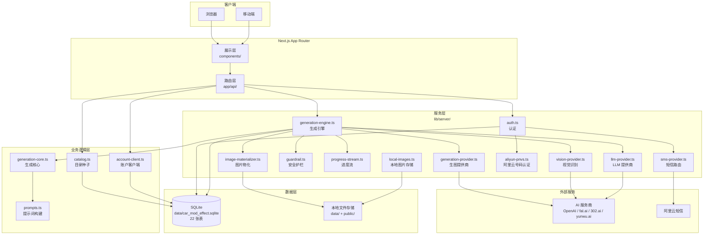
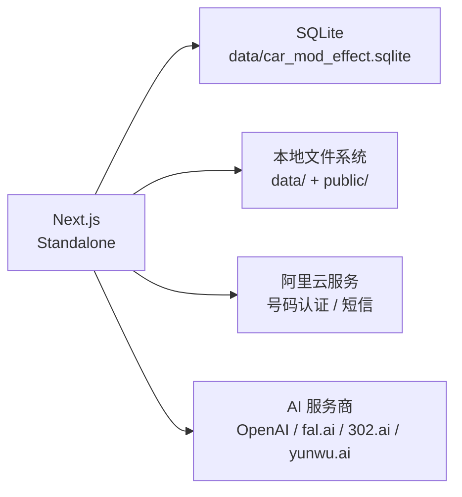

# 架构设计

## 架构概述

ModCar AI 是一个 AI 驱动的汽车改装效果预览平台，基于 Next.js 14 App Router 构建的单页应用。系统以 `CarModStudio` 为核心组件，面向用户提供车辆改装效果的 AI 生成、预览与管理功能。数据库采用 SQLite（WAL 模式），AI 能力通过可插拔的多 Provider 架构实现，支持 OpenAI、fal.ai、302.ai、yunwu.ai 等多种 AI 服务商的灵活切换。

**技术栈**：Next.js 14 App Router、React 18、TypeScript、SQLite（node:sqlite）、shadcn/ui、framer-motion、lucide-react

## 分层结构

系统采用由外到内的五层架构，各层职责明确，边界清晰。

### 1. 路由层（app/api/）

Next.js Route Handlers，作为系统的 HTTP 入口。负责处理外部请求、参数校验与权限检查。所有 API 端点按业务域组织，包括认证（auth）、生成（generations）、目录（catalog）、车库（garage）、聊天（chat）、计费（billing）、管理后台（admin）等模块。

**关键目录**：
- `app/api/auth/` -- 登录、注册、登出、手机验证码、密码管理等认证端点
- `app/api/generations/` -- AI 生成任务创建与查询
- `app/api/chat/` -- 对话模式的消息与会话管理
- `app/api/admin/` -- 管理后台全量 CRUD 端点
- `app/api/billing/` -- 会员套餐、支付、订阅状态

### 2. 业务逻辑层（lib/）

封装核心业务逻辑，为路由层提供服务。此层不依赖具体的服务实现细节，关注业务流程的编排。

**关键文件**：
- `lib/generation-core.ts` -- 生成核心逻辑，定义生成流程的步骤与参数
- `lib/prompts.ts` -- 提示词构建引擎，管理 15 种模板作用域与组合规则
- `lib/catalog.ts` -- 目录种子数据，提供配件/品牌等初始数据
- `lib/account-client.ts` -- 账户客户端，前端账户状态管理

### 3. 服务层（lib/server/）

封装具体的服务实现，包括 AI 能力调用、安全检查、存储管理等。所有服务层代码仅在服务端执行，不暴露给客户端。

**关键文件**：
- `lib/server/auth.ts` -- Cookie-based session 认证实现
- `lib/server/generation-engine.ts` -- 16 步生成流水线的完整引擎
- `lib/server/generation-provider.ts` -- 统一的生图 Provider 接口
- `lib/server/vision-provider.ts` -- 视觉识别能力（车辆识别、配件识别）
- `lib/server/llm-provider.ts` -- LLM 能力（对话意图解析、文本生成）
- `lib/server/guardrail.ts` -- 内容安全护栏
- `lib/server/progress-stream.ts` -- NDJSON 流式进度协议
- `lib/server/image-materializer.ts` -- 图片物化（从 Provider 下载并持久化）
- `lib/server/local-images.ts` -- 本地图片存储管理
- `lib/server/aliyun-pnvs.ts` -- 阿里云号码认证集成
- `lib/server/sms-provider.ts` -- 短信发送路由

### 4. 数据层（lib/server/db.ts）

基于 SQLite 的数据持久化层。使用 Node.js 18+ 内置的 `node:sqlite` 模块，开启 WAL 模式以支持并发读取。包含 22 张数据表，覆盖用户、生成记录、会话、计费、管理等业务域。

**数据库位置**：`data/car_mod_effect.sqlite`

### 5. 展示层（components/）

React 组件层，负责用户界面渲染与交互。采用单组件状态管理模式（useState），使用 framer-motion 实现动画效果，shadcn/ui 提供基础 UI 组件。

**关键组件**：
- `components/car-mod-studio.tsx` -- 核心工作室组件，应用主界面；包含 PC 端浮动垂直菜单栏（AppMenu 导航）与 ComingSoonPlaceholder 占位；改图结果区仅保留对比滑块视图（原图/生成图页签已移除）
- `components/chat-mode.tsx` -- 对话模式组件；移动端场景下通过 onChatApiReady 回调向父组件暴露会话数据与操作方法
- `components/admin-console.tsx` -- 管理后台控制台
- `components/workflow-designer.tsx` -- 工作流设计器
- `components/auth-modal.tsx` -- 认证弹窗
- `components/subscribe-modal.tsx` -- 订阅弹窗
- `components/theme-context.tsx` -- 全站主题 Context（ThemeProvider + useTheme），管理 dark/light 主题状态、localStorage 持久化、系统偏好监听、`<html data-theme>` 属性同步
- `components/mobile/mobile-studio-app.tsx` -- 移动端适配组件；包含 MobileMenuDrawer 全屏菜单抽屉（四子菜单单列布局，配置模式下追加生成历史列表，对话模式下追加历史会话列表）、用户中心子页面（编辑资料/换绑手机号/修改密码/消息提醒）；配置/对话模式切换栏（MobileModeSwitch）与登录/额度提示层（MobileAccessBanner）仅在"改图"菜单（activeMenu === "edit"）下渲染，非改图菜单下仅显示"即将上线"占位

### 层间通信方式

- 路由层调用业务逻辑层和服务层的导出函数，采用直接函数调用
- 业务逻辑层通过服务层的统一接口（Provider 接口）与外部 AI 服务通信
- 服务层通过 `lib/server/db.ts` 的同步 API 与 SQLite 交互
- 展示层通过 `fetch` 调用路由层的 API 端点，获取数据并渲染

## 核心模块

| 模块 | 职责 | 关键文件/目录 |
|------|------|---------------|
| 认证模块 | Cookie-based session 认证，手机验证码/密码登录，管理员权限 | `lib/server/auth.ts`, `app/api/auth/` |
| 生成引擎 | 16 步生成流水线，配置模式/聊天模式，结果质量检查与自动重试 | `lib/server/generation-engine.ts`, `lib/generation-core.ts` |
| 提示词引擎 | 15 种模板作用域，版本化 Prompt Pack，组合规则引擎 | `lib/prompts.ts`, `config/prompt-packs/` |
| 视觉识别 | 车辆识别、配件识别、生成结果检查 | `lib/server/vision-provider.ts` |
| 安全护栏 | 内容安全检查（文件类型、屏蔽词、改装关键词） | `lib/server/guardrail.ts` |
| 计费系统 | 三级会员（free/pro/max），用量账本，额度消费 | `app/api/billing/`, `lib/server/db.ts` |
| 聊天系统 | 对话模式意图解析（本地 + LLM fallback），会话管理 | `app/api/chat/`, `components/chat-mode.tsx` |
| 管理后台 | 配件/品牌/Provider/Workflow/提示词/护栏/配额全量管理 | `components/admin-console.tsx`, `app/api/admin/` |
| 图片存储 | 双重存储（data/ + public/），MIME 检测，路径安全防护 | `lib/server/local-images.ts` |
| 进度流 | NDJSON 流式进度协议，15 个进度步骤 | `lib/server/progress-stream.ts` |

## 技术决策记录（ADR）

### ADR-0005：全站主题切换方案

- **状态**：已采纳
- **日期**：2026-07-26
- **背景**：用户需要在暗色调与明亮色调之间切换全站主题。项目中存在未落地的 `theme-provider.tsx`（引用未安装的 `next-themes`），以及仅移动端生效且被强制写死为 dark 的 `mobileTheme` 局部状态
- **决策**：采用原生 React Context + CSS 变量 + `data-theme` 属性的三层架构。新建 `components/theme-context.tsx` 提供 `ThemeProvider` 与 `useTheme` hook，通过 `<html data-theme="dark|light">` 属性驱动 CSS 变量切换。不引入 `next-themes` 依赖，与项目纯 CSS 技术栈保持一致
- **理由**：零新依赖，与现有纯 CSS 变量体系无缝衔接；`data-theme` 属性选择器与移动端已有的 `[data-theme="light"]` 样式自然合并；防闪烁内联脚本确保首屏无 FOUC
- **影响**：主题状态从 `car-mod-studio.tsx` 局部 state 提升为全局 Context，桌面端与移动端共享同一主题状态；`globals.css` 新增 `[data-theme="light"]` 桌面端变量覆盖集；`app/layout.tsx` 需用 `ThemeProvider` 包裹 `children`。DESIGN-20260726-003 在此基础上重构 PC 端亮色色彩体系：亮色变量取值调整为 #f7f7f7 底 + #ffffff 卡面的纯净白系；新增 `--input-bg` 语义变量统一控件半透明背景；修复 `.app-shell` 硬编码黑底不响应主题的核心问题（新增亮色覆盖 + 弱化金色装饰）；将 PC 端 30 余处硬编码深色背景替换为 CSS 变量或新增亮色覆盖规则（覆盖 Chat 容器、管理后台、工作流设计器、图片容器、控件输入框、`.chat-bg`/`.result-window` 渐变等区域）。DESIGN-20260726-004 补全亮色主题遗漏区域：模式切换页签（`.trae-mode-switch`/`.mode-pill`）变量替换 + 亮色 pill 反转覆盖；配件下拉（`.parts-dropdown-inner`）变量替换；对话模式约 60 处硬编码按 9 个子区域分类替换为 CSS 变量或新增 `[data-theme="light"]` 覆盖（覆盖侧边栏、历史列表、空状态粒子、对话气泡、composer、prompt 下拉等）；订阅/支付弹窗（pricing-template 系列）约 15 处新增亮色覆盖；context-choice-actions 选中态亮色反转覆盖。DESIGN-20260726-005 继续完善主题切换体验：配置模式空状态（`.result-empty`）亮色下背景统一为 var(--bg)、图标线条与文字改为 var(--text) 黑色、图标外框黑色半透明背景改为透明；PC 端明暗切换按钮（`.theme-toggle`）加入通用按钮选择器组获得完整盒模型，新增 `.studio-header-actions .theme-toggle` 72px 宽度约束与中英文按钮完全对齐，亮色下新增 color 覆盖确保 ::after 文字可见；手机端 `MobileFloatingTopBar` 新增明暗切换按钮（复用 useTheme/toggleTheme，Moon/Sun 图标），补全 `.mobile-floating-theme` 在 transition/detached/light+detached 三个规则组中的遗漏。DESIGN-20260726-006 补全弹窗亮色适配：个人中心弹窗（`.account-panel*` 系列）新增约 30 处 `[data-theme="light"]` 亮色覆盖（遮罩/主容器/头部/按钮/用户信息区/额度卡片/Tab 导航/表单/头像选择器/消息提示/空状态），背景统一为 var(--surface)/var(--input-bg)，文字统一为 var(--text)/var(--muted)；会员弹窗（`.pricing-template*` 系列）补充容器层亮色覆盖 4 处（`.pricing-backdrop` 遮罩、`.subscribe-modal.pricing-template` 主容器、`.pricing-template-head h2`/`small` 标题文字）。DESIGN-20260726-007 移动端生成历史迁移至左上角菜单：个人信息页面移除"生成历史"入口，`MobileMenuDrawer` 配置模式下新增生成历史列表区块（复用 `MobileHistorySheet`），统一两种模式下"先看四子菜单、再看对应历史"的心智模型；`MobileProfilePage` 不再包含历史子页面。DESIGN-20260726-008 移动端改图菜单模式切换隔离：`MobileStudioApp` 主 return 中 `mobile-shared-mode-bar`（配置/对话模式切换栏）与 `mobile-access-banner-layer`（登录/额度提示层）由无条件渲染改为 `activeMenu === "edit"` 条件守卫，仅在"改图"菜单下显示；非改图菜单（生图/视频/特效）下隐藏上述两区域，`mobile-coming-soon` 成为唯一主内容
- **关联方案ID**：DESIGN-20260726-002、DESIGN-20260726-003、DESIGN-20260726-004、DESIGN-20260726-005、DESIGN-20260726-006、DESIGN-20260726-007、DESIGN-20260726-008

### ADR-0004：暗黑奢华 UI 设计风格

- **状态**：已采纳
- **日期**：2026-05-01
- **背景**：汽车改装领域用户期望高端、专业的视觉体验，需要差异化的品牌视觉识别
- **决策**：采用纯黑底色（#000000）+ 金黄色品牌色（#614b00）+ 等宽字体（Courier New / JetBrains Mono）的设计语言，UI 组件使用 shadcn/ui，动画使用 framer-motion
- **理由**：暗黑奢华风格与汽车改装文化高度契合，形成差异化的视觉识别，全局 CSS 变量控制确保移动端和桌面端共享设计语言
- **影响**：全局 CSS 变量需统一管理，shadcn/ui 组件需定制主题色以匹配品牌色系

### ADR-0003：Cookie-based Session 认证

- **状态**：已采纳
- **日期**：2026-05-01
- **背景**：需要同时支持 Web 端和移动端，且阿里云号码认证 SDK 依赖 Cookie
- **决策**：使用 httpOnly Cookie 存储 session token（car_mod_session），30 天有效期
- **理由**：CSRF 防护、移动端兼容、无需前端额外存储管理
- **影响**：API 需依赖 Cookie 传递认证，REST API 纯 Token 调用需额外处理

### ADR-0002：采用可插拔多 Provider 架构

- **状态**：已采纳
- **日期**：2026-05-01
- **背景**：需要支持多种 AI 服务商（OpenAI、fal.ai、302.ai、yunwu.ai 等），且需要灵活切换和 A/B 测试
- **决策**：设计统一的 ProviderConfig 类型，按能力分类（llm / vision / image_generation / embedding），各模块通过 Provider ID 选择具体实现
- **理由**：避免厂商锁定，支持快速切换和 A/B 测试不同模型
- **影响**：新增 Provider 需注册配置，API Key 加密存储于数据库

### ADR-0001：选择 SQLite 作为数据库

- **状态**：已采纳
- **日期**：2026-05-01
- **背景**：项目初期数据量小，需要零配置、便携部署，团队熟悉 Node.js 内置 sqlite 模块
- **决策**：使用 Node.js 18+ 内置的 `node:sqlite` 模块，开启 WAL 模式
- **理由**：零外部依赖、单文件部署、内置加密支持（AES-256-CBC 加密 API Key）
- **影响**：不适合高并发写入场景，仅支持单实例部署

## 部署架构

### 部署方式

单实例部署，使用 Next.js standalone 输出模式。整个应用打包为独立可执行文件，无需额外的数据库服务器或对象存储服务。

### 环境配置

- **数据库**：SQLite 文件级数据库，存储于 `data/car_mod_effect.sqlite`，开启 WAL 模式
- **图片存储**：双重存储策略，生成结果存于 `data/results/`，上传文件存于 `data/uploads/`，公共可访问资源同步至 `public/`
- **环境变量**：
  - 阿里云 AccessKey（用于号码认证与短信服务）
  - 短信模板码
  - 各 AI Provider 的 API Key（加密存储于数据库）
- **健康检查**：冒烟测试脚本 `scripts/smoke.mjs` 用于部署后健康检查

### 服务依赖

### 数据存储布局

| 存储位置 | 内容 | 说明 |
|----------|------|------|
| `data/car_mod_effect.sqlite` | SQLite 数据库文件 | 22 张表，WAL 模式 |
| `data/car_mod_effect.sqlite-wal` | WAL 日志文件 | SQLite 写前日志 |
| `data/car_mod_effect.sqlite-shm` | 共享内存文件 | SQLite 共享内存 |
| `data/results/` | AI 生成结果图片 | Provider 返回的生成结果 |
| `data/uploads/` | 用户上传图片 | 包含车辆照片、配件照片等 |

> 最后更新时间：2026-07-26
> 关联方案ID：DESIGN-20260726-006、DESIGN-20260726-007、DESIGN-20260726-008
