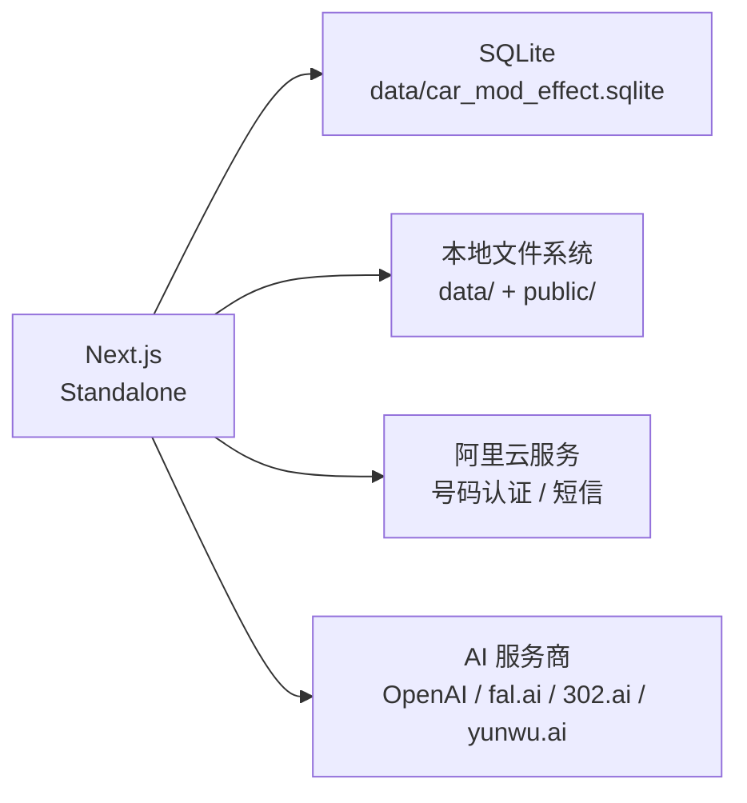

# 架构设计

## 架构概述

ModCar AI 是一个 AI 驱动的汽车改装效果预览平台，基于 Next.js 14 App Router 构建的单页应用。系统以 `CarModStudio` 为核心组件，面向用户提供车辆改装效果的 AI 生成、预览与管理功能。数据库采用 SQLite（WAL 模式），AI 能力通过可插拔的多 Provider 架构实现，支持 OpenAI、fal.ai、302.ai、yunwu.ai 等多种 AI 服务商的灵活切换。

**技术栈**：Next.js 14 App Router、React 18、TypeScript、SQLite（node:sqlite）、shadcn/ui、framer-motion、lucide-react

## 分层结构

系统采用由外到内的五层架构，各层职责明确，边界清晰。

### 1. 路由层（app/api/）

Next.js Route Handlers，作为系统的 HTTP 入口。负责处理外部请求、参数校验与权限检查。所有 API 端点按业务域组织，包括认证（auth）、生成（generations）、目录（catalog）、车库（garage）、聊天（chat）、计费（billing）、管理后台（admin）等模块。

**关键目录**：
- `app/api/auth/` -- 登录、注册、登出、手机验证码、密码管理等认证端点
- `app/api/generations/` -- AI 生成任务创建与查询
- `app/api/chat/` -- 对话模式的消息与会话管理
- `app/api/admin/` -- 管理后台全量 CRUD 端点（含订单管理）
- `app/api/billing/` -- 会员套餐、支付、订阅状态、用户订单查询

### 2. 业务逻辑层（lib/）

封装核心业务逻辑，为路由层提供服务。此层不依赖具体的服务实现细节，关注业务流程的编排。

**关键文件**：
- `lib/generation-core.ts` -- 生成核心逻辑，定义生成流程的步骤与参数
- `lib/prompts.ts` -- 提示词构建引擎，管理 15 种模板作用域与组合规则
- `lib/catalog.ts` -- 目录种子数据，提供配件/品牌等初始数据
- `lib/account-client.ts` -- 账户客户端，前端账户状态管理

### 3. 服务层（lib/server/）

封装具体的服务实现，包括 AI 能力调用、安全检查、存储管理等。所有服务层代码仅在服务端执行，不暴露给客户端。

**关键文件**：
- `lib/server/auth.ts` -- Cookie-based session 认证实现
- `lib/server/generation-engine.ts` -- 16 步生成流水线的完整引擎
- `lib/server/generation-provider.ts` -- 统一的生图 Provider 接口
- `lib/server/vision-provider.ts` -- 视觉识别能力（车辆识别、配件识别）
- `lib/server/llm-provider.ts` -- LLM 能力（对话意图解析、文本生成）
- `lib/server/guardrail.ts` -- 内容安全护栏
- `lib/server/progress-stream.ts` -- NDJSON 流式进度协议
- `lib/server/image-materializer.ts` -- 图片物化（从 Provider 下载并持久化）
- `lib/server/local-images.ts` -- 本地图片存储管理
- `lib/server/aliyun-pnvs.ts` -- 阿里云号码认证集成
- `lib/server/sms-provider.ts` -- 短信发送路由

### 4. 数据层（lib/server/db.ts）

基于 SQLite 的数据持久化层。使用 Node.js 18+ 内置的 `node:sqlite` 模块，开启 WAL 模式以支持并发读取。包含 22 张数据表，覆盖用户、生成记录、会话、计费、管理等业务域。

**数据库位置**：`data/car_mod_effect.sqlite`

### 5. 展示层（components/）

React 组件层，负责用户界面渲染与交互。采用单组件状态管理模式（useState），使用 framer-motion 实现动画效果，shadcn/ui 提供基础 UI 组件。

**关键组件**：
- `components/car-mod-studio.tsx` -- 核心工作室组件，应用主界面；包含 PC 端浮动垂直菜单栏（AppMenu 导航）与 ComingSoonPlaceholder 占位
- `components/chat-mode.tsx` -- 对话模式组件
- `components/admin-console.tsx` -- 管理后台控制台
- `components/workflow-designer.tsx` -- 工作流设计器
- `components/auth-modal.tsx` -- 认证弹窗
- `components/subscribe-modal.tsx` -- 订阅弹窗
- `components/mobile/mobile-studio-app.tsx` -- 移动端适配组件；包含 MobileMenuDrawer 全屏菜单抽屉、chat 模式内嵌侧栏按钮、用户中心历史子页面

### 层间通信方式

- 路由层调用业务逻辑层和服务层的导出函数，采用直接函数调用
- 业务逻辑层通过服务层的统一接口（Provider 接口）与外部 AI 服务通信
- 服务层通过 `lib/server/db.ts` 的同步 API 与 SQLite 交互
- 展示层通过 `fetch` 调用路由层的 API 端点，获取数据并渲染

## 核心模块

| 模块 | 职责 | 关键文件/目录 |
|------|------|---------------|
| 认证模块 | Cookie-based session 认证，手机验证码/密码登录，管理员权限 | `lib/server/auth.ts`, `app/api/auth/` |
| 生成引擎 | 16 步生成流水线，配置模式/聊天模式，结果质量检查与自动重试；调用 Provider 时按 `options.imageParams` 注入可配置画质参数（provider-config 驱动，替代硬编码环境变量） | `lib/server/generation-engine.ts`, `lib/generation-core.ts`, `lib/server/provider-param-injector.ts` |
| 提示词引擎 | 15 种模板作用域，版本化 Prompt Pack，组合规则引擎 | `lib/prompts.ts`, `config/prompt-packs/` |
| 视觉识别 | 车辆识别、配件识别、生成结果检查 | `lib/server/vision-provider.ts` |
| 安全护栏 | 内容安全检查（文件类型、屏蔽词、改装关键词） | `lib/server/guardrail.ts` |
| 计费系统 | 三级会员（free/pro/max），用量账本，额度消费，模拟支付与订单管理 | `app/api/billing/`, `lib/server/db.ts` |
| 聊天系统 | 对话模式意图解析（本地 + LLM fallback），会话管理 | `app/api/chat/`, `components/chat-mode.tsx` |
| 管理后台 | 配件/品牌/Provider/Workflow/提示词/护栏/配额/订单全量管理；每个 Provider 配置新增「画质参数」分区，支持参数名与枚举值双可配（数据驱动 + 内置模板） | `components/admin-console.tsx`, `app/api/admin/`, `lib/provider-image-params.ts` |
| 图片存储 | 双重存储（data/ + public/），MIME 检测，路径安全防护，公网域名配置管理 | `lib/server/local-images.ts`, `lib/server/generation-provider.ts` |
| 进度流 | NDJSON 流式进度协议，15 个进度步骤 | `lib/server/progress-stream.ts` |
| 运营分析模块 | 时序聚合查询、生成记录分析、用户洞察、失败分析、成本核算、订单分析、额度监控、异常告警、CSV 导出 | `lib/server/analytics-queries.ts`, `lib/server/export-service.ts`, `lib/server/alert-scanner.ts`, `app/api/admin/analytics/`, `app/api/admin/generations/` |

## 技术决策记录（ADR）

### ADR-0006：异常检测与告警持久化方案

- **状态**：已采纳
- **日期**：2026-07-29
- **背景**：运营分析平台阶段四至六需要额度监控和异常告警能力。需要决定异常检测的触发时机和告警数据的持久化方式。
- **决策**：采用请求时触发（on-demand）的扫描模式，在管理员查询告警列表 API 时执行 `scanAnomalies()` 扫描；告警记录持久化到独立的 `alert_records` 表，支持状态流转（pending → confirmed/ignored）和处理人追踪。
- **理由**：1) 请求时扫描避免了额外的定时任务基础设施（cron/queue），与现有 SQLite 单体架构一致 2) 独立表存储告警记录使管理员可以跨请求查看历史告警、追踪处理状态 3) 每小时去重逻辑（同一用户同一类型同一小时仅记录一条）防止告警洪水 4) 状态流转字段（resolved_at/resolver_id）支持审计追溯
- **影响**：新增 `alert_records` 表及 3 个索引；新增 `lib/server/alert-scanner.ts` 模块；告警列表 API 在每次请求时执行扫描，有轻微性能开销（约 50-100ms）
- **关联方案ID**：DESIGN-20260729-003

### ADR-0007：Provider 级画质参数配置采用通用 JSON 列 + 内置模板

- **状态**：已采纳
- **日期**：2026-08-07
- **背景**：此前 6 个画质参数（A 类 `quality`、B 类 `imageSize`/`resolution`）硬编码在代码中或通过环境变量（如 `YUNWU_IMAGE_QUALITY`、`YUNWU_GEMINI_IMAGE_SIZE`、`YUNWU_NANO_RESOLUTION`、`NANO_BANANA_302_RESOLUTION`）注入，跨 7 个生图 Provider 难以统一配置，管理员无法在后台按需调整。需要决定 Provider 级画质参数的存储与配置方式。
- **决策**：在 `provider_configs` 表新增通用 JSON 扩展列 `options_json TEXT NOT NULL DEFAULT '{}'`，当前承载 `imageParams`（`Array<{ key, label, options, value }>`）；管理后台为每个具备 `image_generation` 能力的 Provider 提供「画质参数」分区，参数名（`key`）与枚举值（`options`）双可配，平台内置各 Provider 的默认模板（`lib/provider-image-params.ts`），用户可重置为内置默认值或完全自定义。参数注入逻辑（`lib/server/provider-param-injector.ts`）依据 Provider 协议类型（A 类 OpenAI 兼容 `/images/edits`、`/images/generations`；B 类 Gemini `/generateContent`、Nano Banana）映射到对应字段，保留两个非 API 语义保留值：`''` 表示不传该参数、`'__auto__'` 表示跟随原图/自适应推导（区别于 API 字面量 `auto`）。
- **理由**：1) 通用 JSON 列避免为每个 Provider 新增专用列或频繁做 schema migration，新增 Provider 仅需在前端模板中声明，无需改表 2) 数据驱动的参数名 + 枚举值双可配，覆盖各 Provider 字段差异，同时内置模板保证开箱即用 3) 保留值语义使「不传」「自适应」成为一等能力，避免把平台决策硬编码为某个字面量 4) `options_json` 走 DB 优先映射（与 `console_url` 一致），`ON CONFLICT DO UPDATE` 列表排除该列，升级时通过 `backfillProviderImageParams()` 从环境变量有效值回填默认值，保证从旧版平滑迁移且零行为变化
- **影响**：新增 `lib/provider-image-params.ts`、`lib/server/provider-param-injector.ts`；`provider_configs` 新增 `options_json` 列；`lib/server/db.ts`、`lib/catalog.ts`、`lib/server/generation-provider.ts`、`lib/server/provider-test.ts`、`app/api/admin/provider-configs/route.ts`、`components/admin-console.tsx`、`app/globals.css` 同步改造；原环境变量画质参数标记为废弃（仍在缺失内置模板时作为兜底）
- **关联方案ID**：DESIGN-20260807-001

### ADR-0005：Recharts 图表库选型

- **状态**：已采纳
- **日期**：2026-07-29
- **背景**：运营分析平台需要折线图、柱状图、饼图等可视化图表，现有管理后台仅使用原生 HTML 表格
- **决策**：引入 Recharts 作为图表库
- **理由**：1) Recharts 基于 React 组件式 API，与项目技术栈一致 2) 支持 ResponsiveContainer 自适应宽度 3) 社区活跃，文档完善 4) 包体积合理，支持按需引入 5) 与暗黑主题兼容，可通过 contentStyle/wrapperStyle 自定义样式
- **影响**：新增 recharts 依赖，图表样式通过 CSS 变量适配暗黑主题

### ADR-0004：暗黑奢华 UI 设计风格

- **状态**：已采纳
- **日期**：2026-05-01
- **背景**：汽车改装领域用户期望高端、专业的视觉体验，需要差异化的品牌视觉识别
- **决策**：采用纯黑底色（#000000）+ 金黄色品牌色（#614b00）+ 等宽字体（Courier New / JetBrains Mono）的设计语言，UI 组件使用 shadcn/ui，动画使用 framer-motion
- **理由**：暗黑奢华风格与汽车改装文化高度契合，形成差异化的视觉识别，全局 CSS 变量控制确保移动端和桌面端共享设计语言
- **影响**：全局 CSS 变量需统一管理，shadcn/ui 组件需定制主题色以匹配品牌色系

### ADR-0003：Cookie-based Session 认证

- **状态**：已采纳
- **日期**：2026-05-01
- **背景**：需要同时支持 Web 端和移动端，且阿里云号码认证 SDK 依赖 Cookie
- **决策**：使用 httpOnly Cookie 存储 session token（car_mod_session），30 天有效期
- **理由**：CSRF 防护、移动端兼容、无需前端额外存储管理
- **影响**：API 需依赖 Cookie 传递认证，REST API 纯 Token 调用需额外处理

### ADR-0002：采用可插拔多 Provider 架构

- **状态**：已采纳
- **日期**：2026-05-01
- **背景**：需要支持多种 AI 服务商（OpenAI、fal.ai、302.ai、yunwu.ai 等），且需要灵活切换和 A/B 测试
- **决策**：设计统一的 ProviderConfig 类型，按能力分类（llm / vision / image_generation / embedding），各模块通过 Provider ID 选择具体实现
- **理由**：避免厂商锁定，支持快速切换和 A/B 测试不同模型
- **影响**：新增 Provider 需注册配置，API Key 加密存储于数据库

### ADR-0001：选择 SQLite 作为数据库

- **状态**：已采纳
- **日期**：2026-05-01
- **背景**：项目初期数据量小，需要零配置、便携部署，团队熟悉 Node.js 内置 sqlite 模块
- **决策**：使用 Node.js 18+ 内置的 `node:sqlite` 模块，开启 WAL 模式
- **理由**：零外部依赖、单文件部署、内置加密支持（AES-256-CBC 加密 API Key）
- **影响**：不适合高并发写入场景，仅支持单实例部署

## 部署架构

### 部署方式

单实例部署，使用 Next.js standalone 输出模式。整个应用打包为独立可执行文件，无需额外的数据库服务器或对象存储服务。

### 环境配置

- **数据库**：SQLite 文件级数据库，存储于 `data/car_mod_effect.sqlite`，开启 WAL 模式
- **图片存储**：双重存储策略，生成结果存于 `data/results/`，上传文件存于 `data/uploads/`，公共可访问资源同步至 `public/`
- **环境变量**：
  - 阿里云 AccessKey（用于号码认证与短信服务）
  - 短信模板码
  - 各 AI Provider 的 API Key（加密存储于数据库）
  - 公网域名（`PROVIDER_PUBLIC_BASE_URL` / `NEXT_PUBLIC_APP_URL` / `APP_URL` / `SITE_URL`，可在管理后台"域名配置"页面热更新，数据库配置优先于环境变量）
- **健康检查**：冒烟测试脚本 `scripts/smoke.mjs` 用于部署后健康检查

### 服务依赖

### 数据存储布局

| 存储位置 | 内容 | 说明 |
|----------|------|------|
| `data/car_mod_effect.sqlite` | SQLite 数据库文件 | 24 张表，WAL 模式 |
| `data/car_mod_effect.sqlite-wal` | WAL 日志文件 | SQLite 写前日志 |
| `data/car_mod_effect.sqlite-shm` | 共享内存文件 | SQLite 共享内存 |
| `data/results/` | AI 生成结果图片 | Provider 返回的生成结果 |
| `data/uploads/` | 用户上传图片 | 包含车辆照片、配件照片等 |

> 最后更新时间：2026-08-07
> 关联方案ID：DESIGN-20260729-001、DESIGN-20260729-002、DESIGN-20260729-003、DESIGN-20260806-006、DESIGN-20260807-001
