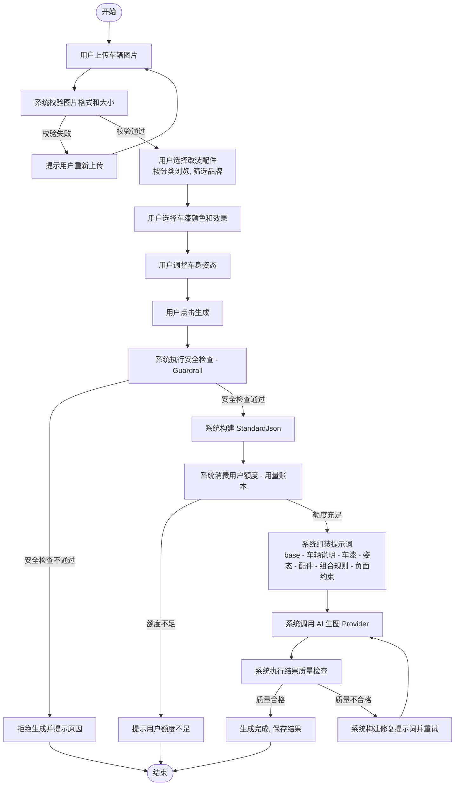
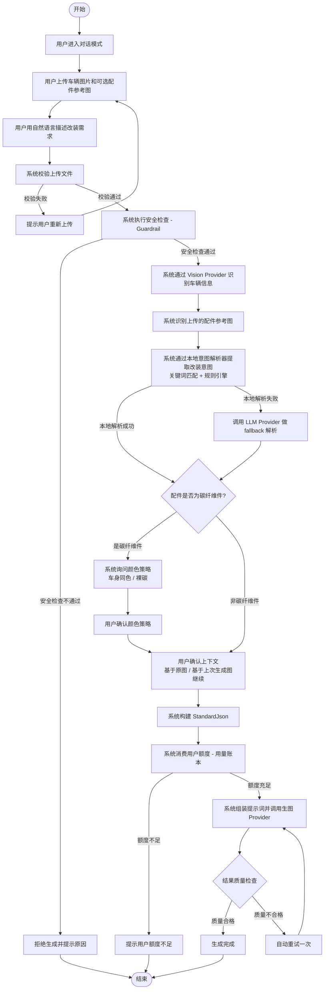
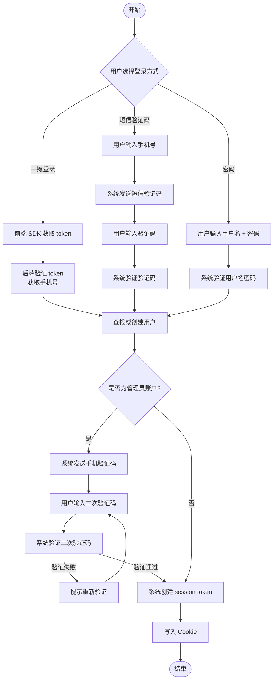
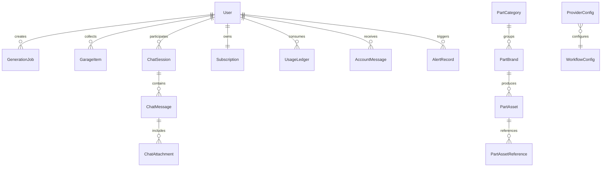

# 业务领域

本文档定义 ModCar AI 平台的业务术语、核心流程、业务规则与实体关系，供开发团队、AI Agent 及文档维护者参照。

---

## 术语表

| 术语 | 定义 | 备注 |
|------|------|------|
| 车辆图（Vehicle Image） | 用户上传的待改装车辆原始照片 | 支持 JPEG/PNG/WebP，最大 20MB |
| 改装配件（Part Asset） | 可安装到车辆上的改装部件，包含品牌、型号、颜色、涂装、参考图等属性 | 存储于 part_assets 表 |
| 配件分类（Part Category） | 改装配件的类型分组 | 每个分类具有配置类型（configType），决定管理端配置面板和用户端渲染方式（已更新 2026-08-06） |
| 配置类型（Config Type） | 配件分类的配置模式，决定管理端和用户端的渲染逻辑 | 三种枚举值：`brand_resource`（品牌-资源，需先选品牌再选资源）、`resource`（资源，直接选择资源，可配置是否有图）、`resource_subcategory`（资源-细分类，选择资源后需进一步选细分类）。DESIGN-20260806-003 新增 |
| 配件品牌（Part Brand） | 改装配件的生产厂商品牌 | 如 BBS、Brembo、Akrapovic、APR 等 |
| 参考图（Reference Image） | 配件的实物照片，用于 AI 生成时参考外观 | 角色：shape（形状）、material（材质）、color（颜色）、install（安装效果）、full（完整参考）、avoid（避免） |
| 车漆（Paint Option） | 车身涂装颜色选项 | 包含 hex 值和 prompt 描述 |
| 车漆效果（Paint Finish Effect） | 车漆表面质感 | 7 种：gloss（亮光）、metallic（金属）、matte（哑光）、satin（缎面）、pearl（珍珠）、chrome（铬）、gradient（渐变） |
| 姿态（Stance） | 车身高度调整 | 0-100 数值映射：stock(0)/slight(30)/flush(60)/aggressive(90) |
| 颜色策略（Part Color Policy） | 改装配件与车身颜色的关系 | body_color（车身同色）、exposed_carbon（裸碳）、part_reference_color（参考图原色） |
| 配置模式（Config Mode） | 用户通过 UI 手动选择配件、车漆、姿态后触发生成 | GenerationMode = "config" |
| 聊天模式（Chat Mode） | 用户通过自然语言描述改装需求，AI 解析意图后生成 | GenerationMode = "chat" |
| 生成任务（Generation Job） | 一次完整的 AI 图片生成过程 | 16 步流水线，状态：queued/running/succeeded/failed |
| StandardJson | 标准化生成规格描述 | 包含 vehicle、paint、stance、parts、style、constraints |
| 提示词预设（Prompt Preset） | 预定义的提示词模板集 | 含 body prompt 和 negative prompt |
| 提示词模板（Prompt Template） | 特定作用域的提示词片段 | 15 种作用域：base/config_base/config_mode/chat_mode/category/part/combo 等 |
| 工作流（Workflow） | AI 生成的步骤编排 | 包含节点、边、故障策略、重试策略 |
| Provider | AI 服务提供商 | 能力类型：llm、vision、image_generation、embedding |
| 画质参数（Image Quality Parameters） | Provider 级可配置的生图参数，决定生成结果的分辨率/清晰度等画质属性 | 每个具备 `image_generation` 能力的 Provider 在管理后台拥有独立「画质参数」分区，参数名（key）与枚举值（options）双可配，平台内置默认模板；DESIGN-20260807-001 新增 |
| 画质参数保留值（Image Param Reserved Values） | 两个非 API 语义的保留值，表示平台决策而非传给 Provider 的字面量 | `''`（IMAGE_PARAM_VALUE_NONE）表示不传该参数、`'__auto__'`（IMAGE_PARAM_VALUE_AUTO）表示跟随原图/自适应推导；两者均不同于 API 字面量 `auto` |
| 测试配件设置（Test Accessory Config） | 管理后台「模型 API」菜单底部的全局单份配置，作为画质参数对比测试的固定基准 | 内容等同用户配置页左半：原车图 + 各配件位置资源 + 车漆 + 姿态；保存后全局固定，所有 Provider 的对比测试统一取用，非按 Provider 维度；DESIGN-20260807-002 新增 |
| 画质参数对比测试（Image Param Compare Test） | 管理员对某一画质参数的全部枚举值并行发起真实生图、横向比较出图差异的能力 | 首次点击并行生图并缓存，非首次直接展示，单值可「重新生成」；为真实生图、消耗底层模型额度/费用，但**不扣用户额度、不写 `generation_jobs`/`usage_ledger`**，与用户生成记录隔离；结果按 (Provider, 参数, 枚举值) 持久化、纯缓存不失效；DESIGN-20260807-002 新增 |
| 安全护栏（Guardrail） | 内容安全检查机制 | 检查文件类型、屏蔽词、改装关键词 |
| 会员计划（Membership Plan） | 用户订阅等级 | free（725积分/月）、pro（2210积分/月）、max（6160积分/月） |
| 支付订单（Payment Order） | 用户购买会员套餐的交易记录 | 包含支付方式（微信/支付宝）、金额（分）、状态（pending/paid/failed/refunded） |
| 用量账本（Usage Ledger） | 用户积分消费记录 | 每次生成消费积分，配置模式和聊天模式消耗不同 |
| 车库（Garage） | 用户收藏的生成结果 | 可查看历史生成记录和效果图 |
| 意图解析（Intent Parse） | 从自然语言中提取改装意图 | 本地解析（关键词匹配+规则引擎）+ LLM fallback |
| 一键登录（One-Tap Login） | 基于运营商号码认证的无密码登录 | 集成阿里云号码认证 SDK |
| 提示词包（Prompt Pack） | 版本化的提示词配置集合 | Git-tracked，当前稳定版 effective-prompt-v1-2026-05-29 |
| 失败率（Failure Rate） | 生成任务失败数占总生成数的百分比 | 按时段聚合，支持按模式/Provider 分组 |
| 异常日期（Anomaly Date） | 失败率超过历史均值 2 倍标准差的日期 | 运营分析平台自动检测并标注 |
| 成本（Cost） | Provider 调用产生的费用 | 以分为单位存储（cost_cents），支持按用户/类别/Provider 维度统计 |
| ARPU | 每付费用户平均收入 | 总收入 / 付费用户数，以分为单位 |
| 付费转化率（Conversion Rate） | 付费用户数占总用户数的百分比 | 付费用户 = 有 status=paid 订单的用户 |
| 续费率（Renewal Rate） | 到期订阅中续费的比例 | 按月统计：renewed / expired * 100% |
| 额度余额（Quota Balance） | 用户当前剩余可用额度 | 分为已耗尽(0)、即将耗尽(<20%)、充足(>=20%)三档 |
| 告警记录（Alert Record） | 系统检测到的用户异常行为记录 | 类型：high_frequency（高频生成）、high_cost（高成本） |

---

## 核心业务流程

### 流程1：配置模式生成流程

配置模式下，用户通过 UI 界面手动选择改装配件、车漆颜色与效果、车身姿态，确认后系统执行 AI 图片生成。

**分步描述：**

| 步骤 | 参与角色 | 输入 | 输出 | 状态转换 |
|------|----------|------|------|----------|
| 1. 上传车辆图片 | 用户 | 车辆图（JPEG/PNG/WebP, <=20MB） | 图片文件存储至服务器 | 无 |
| 2. 校验图片格式和大小 | 系统 | 已上传图片文件 | 校验结果（通过/拒绝） | GenerationJob 未创建 |
| 3. 选择改装配件 | 用户 | 配件分类列表、配件品牌列表 | 选定的 PartAsset 集合 | GenerationJob 未创建 |
| 4. 选择车漆颜色和效果 | 用户 | 车漆选项列表、车漆效果列表 | 选定的 Paint Option + Paint Finish Effect | GenerationJob 未创建 |
| 5. 调整车身姿态 | 用户 | 姿态滑块（0-100） | 选定的 Stance 值 | GenerationJob 未创建 |
| 6. 点击生成 | 用户 | 所有已选项 | 触发生成请求 | GenerationJob 创建，状态 queued |
| 7. 执行安全检查 | 系统（Guardrail） | 用户输入、图片、配置内容 | 安全检查结果（通过/拒绝） | queued / 拒绝终止 |
| 8. 构建 StandardJson | 系统 | 车辆图、Paint Option、Stance、PartAsset 集合 | StandardJson 对象 | running |
| 9. 消费用户额度 | 系统（用量账本） | 用户 Subscription 信息、GenerationMode | 积分扣减记录 | running / 额度不足终止 |
| 10. 组装提示词 | 系统（提示词包） | StandardJson、Prompt Template 集合 | 最终 body prompt + negative prompt | running |
| 11. 调用 AI 生图 Provider | 系统（Provider） | 提示词、车辆图、配件参考图 | AI 生成图片 | running |
| 12. 执行结果质量检查 | 系统 | AI 生成图片 | 质量评估结果（合格/不合格） | running |
| 13. 修复提示词重试 | 系统 | 原始提示词 + 质量问题描述 | 修复后的提示词 | running（重试一次） |
| 14. 保存结果 | 系统 | 合格的生成图片、StandardJson | 生成结果写入数据库、车库 | succeeded |

---

### 流程2：聊天模式生成流程

聊天模式下，用户通过自然语言描述改装需求，系统通过意图解析引擎提取改装意图，自动构建生成规格并执行 AI 生图。

**分步描述：**

| 步骤 | 参与角色 | 输入 | 输出 | 状态转换 |
|------|----------|------|------|----------|
| 1. 进入对话模式 | 用户 | 无 | ChatSession 创建/复用 | 无 |
| 2. 上传车辆图片和配件参考图 | 用户 | 车辆图（<=20MB）、参考图（最多 8 张，总大小 <=180MB） | ChatAttachment 存储 | 无 |
| 3. 用自然语言描述改装需求 | 用户 | 改装需求文本 | ChatMessage 记录 | 无 |
| 4. 校验上传文件 | 系统 | 已上传文件集合 | 校验结果（通过/拒绝） | 无 |
| 5. 执行安全检查 | 系统（Guardrail） | 用户输入、图片 | 安全检查结果（通过/拒绝） | 无 / 拒绝终止 |
| 6. Vision Provider 识别车辆信息 | 系统（Vision Provider） | 车辆图 | 车辆品牌、型号、颜色等信息 | 无 |
| 7. 识别配件参考图 | 系统 | 配件参考图集合 | 配件分类、品牌、型号识别结果 | 无 |
| 8. 本地意图解析 | 系统（意图解析引擎） | 用户文本 + 识别结果 | 结构化改装意图（配件、车漆、姿态等） | 无 |
| 9. LLM fallback 解析 | 系统（LLM Provider） | 用户文本 + 识别结果（本地解析失败时） | 结构化改装意图 | 无 |
| 10. 确认颜色策略（碳纤维件） | 系统/用户 | 碳纤维配件信息 | 用户选择 Part Color Policy（body_color / exposed_carbon） | 无 |
| 11. 确认上下文 | 用户 | 原图或上次生成图 | 确认生成基准图 | GenerationJob 创建，状态 queued |
| 12. 构建 StandardJson | 系统 | 意图解析结果、用户确认信息 | StandardJson 对象 | running |
| 13. 消费用户额度 | 系统（用量账本） | 用户 Subscription 信息、GenerationMode | 积分扣减记录 | running / 额度不足终止 |
| 14. 组装提示词并调用 Provider | 系统（提示词包 + Provider） | StandardJson、提示词 | AI 生成图片 | running |
| 15. 结果质量检查与自动重试 | 系统 | AI 生成图片 | 质量评估结果；不合格时修复提示词重试一次 | running（重试） |
| 16. 生成完成 | 系统 | 合格的生成图片、StandardJson | 生成结果写入数据库、车库 | succeeded |

---

### 流程3：用户认证流程

用户可通过一键登录、短信验证码或密码方式登录系统，管理员账户需额外进行手机验证码二次验证。

**分步描述：**

| 步骤 | 参与角色 | 输入 | 输出 | 状态转换 |
|------|----------|------|------|----------|
| 1. 选择登录方式 | 用户 | 无 | 选择的登录方式标识 | 无 |
| 2a. 一键登录 - 获取 token | 用户（前端 SDK） | 阿里云号码认证 SDK token | token 字符串 | 无 |
| 2a. 后端验证 token | 系统 | token | 手机号 | 无 |
| 2b. 短信登录 - 输入手机号 | 用户 | 手机号 | 待验证状态 | 无 |
| 2b. 发送验证码 | 系统 | 手机号 | 短信验证码（非生产环境使用 mock，返回 devCode） | 无 |
| 2b. 验证验证码 | 系统 | 手机号 + 用户输入验证码 | 验证结果 | 无 |
| 2c. 密码登录 - 验证凭证 | 系统 | 用户名 + 密码 | 验证结果 | 无 |
| 3. 查找或创建用户 | 系统 | 手机号或用户名 | User 实体 | 无 |
| 4. 管理员二次验证（管理员专属） | 系统/用户 | 管理员手机号 | 二次验证结果 | 未登录 / 验证失败 |
| 5. 创建 session token | 系统 | User 实体 | session token | 已登录 |
| 6. 写入 Cookie | 系统 | session token | 设置 Cookie | 已认证 |

---

## 业务规则

| 编号 | 规则描述 | 适用条件 | 例外情况 |
|------|----------|----------|----------|
| BR-001 | 免费用户每月 725 积分，Pro 用户 2210 积分，Max 用户 6160 积分。每次生成消费固定积分。 | 所有用户发起生成任务时 | 无 |
| BR-002 | 上传图片仅支持 JPEG、PNG、WebP 格式，单张最大 20MB。 | 用户上传车辆图时 | 无 |
| BR-003 | 聊天模式配件参考图最多上传 8 张，总大小不超过 180MB。 | 用户在聊天模式下上传配件参考图时 | 无 |
| BR-004 | 碳纤维类配件（exposed_carbon 策略）需要用户确认颜色策略：车身同色或裸碳。 | 聊天模式中意图解析结果包含碳纤维配件时 | 配置模式下由用户主动选择，无需额外确认 |
| BR-005 | 生成结果质量检查不合格时，系统自动重试一次（修复提示词重生成）。 | 配置模式和聊天模式的生成结果质量检查不合格时 | 重试一次后仍不合格则标记为 failed，不再重试 |
| BR-006 | 管理员账户需要额外手机验证码二次验证才能登录。 | 管理员角色用户尝试登录时 | 非管理员用户无此要求 |
| BR-007 | 用户可通过订阅弹窗自助开通会员（模拟支付模式），点击付费套餐按钮后串行调用 checkout + mock-paid 完成订阅。当前为模拟支付，不接入真实支付网关。 | 用户尝试自助升级会员计划时 | 管理员也可直接为用户分配会员等级；未来接入真实支付后将引入支付网关限制 |
| BR-008 | 提示词包使用 Git 版本管理，当前稳定版 effective-prompt-v1-2026-05-29，部署前必须运行 prompt:validate 和 config:export。 | 部署提示词包相关变更时 | 无 |
| BR-009 | 非生产环境短信服务自动使用 mock 模式，返回 devCode。 | 环境变量非 production 时调用短信服务 | 生产环境使用真实短信服务 |
| BR-010 | 用户标签系统包含自动标签和手动标签两类。自动标签在运行时计算，不持久化：套餐类型（直接取 users.plan）、活跃度（最近 30 天生成次数：>50 高活、10-50 中活、1-10 低活、0 流失预警）、付费意愿（查询 subscriptions 表是否有 status='active' 记录）、用户价值（按 totalCostCents 排名：前 10% 高价值、10-40% 中价值、其余低价值）。手动标签由管理员在用户详情页添加/删除，持久化到 users.tags_json。 | 所有用户在管理后台查看/分析时 | 无 |
| BR-011 | 留存率定义：注册后第 N 日仍有生成行为的用户占该批次注册用户的比例。第 N 日定义为注册时间戳 + N*24h 到 + (N+1)*24h 的时间窗口。 | 运营分析平台计算留存率指标时 | 无 |
| BR-012 | 活跃度指标定义：DAU = 当日有至少 1 次生成行为的去重用户数；WAU = 过去 7 天（含当日）有生成行为的去重用户数；MAU = 过去 30 天（含当日）有生成行为的去重用户数。 | 运营分析平台计算用户活跃指标时 | 无 |
| BR-013 | 失败率异常检测：计算查询窗口内每日失败率的均值和标准差，当某日失败率超过均值 + 2 倍标准差时标记为异常日期。 | 运营分析平台失败分析模块 | 当查询窗口内数据点不足 2 个时不执行异常检测 |
| BR-014 | 成本统计以 generation_jobs.cost_cents 字段为数据源，支持按用户（user_id）、配件类别（selections 中的 category）、Provider（provider 字段）三个维度聚合。 | 运营分析平台成本分析模块 | 成本为 0 的记录不纳入分布统计 |
| BR-015 | 付费转化率 = 有 status=paid 订单的用户数 / 总用户数 * 100%。续费率 = 当月续费订阅数 / 当月到期订阅数 * 100%。ARPU = 总收入 / 付费用户数。 | 运营分析平台订单分析模块 | 当前为模拟支付模式，退款率统计基于 status=refunded 订单 |
| BR-016 | 额度余额分档：已耗尽 = 剩余额度为 0；即将耗尽 = 剩余额度 < 套餐上限的 20%；充足 = 剩余额度 >= 套餐上限的 20%。 | 运营分析平台额度监控模块 | 内部/内测用户不受此分档限制 |
| BR-017 | 异常告警触发条件：high_frequency = 用户当日生成次数超过 100 次；high_cost = 用户当日总成本超过 5000 分（50 元）。同一用户同一类型同一小时内仅记录一条告警。 | 运营分析平台告警扫描 | 阈值可通过代码常量调整，当前为硬编码 |
| BR-018 | 画质参数采用 Provider 级配置，参数名与枚举值双可配，平台内置各 Provider 默认模板；保留值 `''` 表示不传该参数、`'__auto__'` 表示跟随原图/自适应推导，二者均不等同于 API 字面量 `auto`。A 类 Provider（OpenAI 兼容 `/images/edits`、`/images/generations`）使用 `quality` 字段，B 类 Provider（Gemini `/generateContent`、Nano Banana）使用 `imageSize`/`resolution` 并嵌套于 `generationConfig.imageConfig`。 | 管理后台配置具备 image_generation 能力的 Provider 时 | 原环境变量画质参数（YUNWU_IMAGE_QUALITY 等）已废弃，仅在缺失内置模板时作为兜底；首次升级由 backfill 从环境变量有效值回填默认值，保证零行为变化 |
| BR-019 | 画质参数对比测试为真实生图（消耗底层模型额度/费用），但**不扣减任何用户额度、不写入 `generation_jobs`/`usage_ledger`**，与用户生成记录天然隔离，不污染运营分析与成本统计；结果按 (Provider, 参数, 枚举值) 持久化缓存（纯缓存不失效，仅「重新生成」刷新），以「测试配件设置」全局单份配置为固定基准。 | 管理后台对某具备 image_generation 能力的 Provider 执行「对比测试」时 | 「一键测试所有模型」(`test-all`) 为最小连通性测试（不出图），与对比测试职责区分并存；对比测试须先配置「测试配件设置」（原图+至少一项配件选择）否则拒绝执行 |

---

## 实体关系

### 核心实体关系图

### 关系详细说明

| 关系 | 基数 | 说明 |
|------|------|------|
| User -> GenerationJob | 1:N | 一个用户可创建多个生成任务，每个任务仅归属于一个用户 |
| User -> GarageItem | 1:N | 一个用户可收藏多个生成结果到车库 |
| User -> ChatSession | 1:N | 一个用户可拥有多个对话会话 |
| User -> Subscription | 1:1 | 一个用户对应一个订阅计划（会员等级） |
| User -> UsageLedger | 1:N | 一个用户可有多条积分消费记录 |
| User -> AccountMessage | 1:N | 一个用户可接收多条账户消息通知 |
| User -> AlertRecord | 1:N | 一个用户可触发多条异常告警记录，告警由系统自动扫描生成 |
| ChatSession -> ChatMessage | 1:N | 一个对话会话包含多条消息 |
| ChatMessage -> ChatAttachment | 1:N | 一条消息可包含多个附件（车辆图或配件参考图） |
| PartCategory -> PartBrand | 1:N | 一个配件分类下有多个品牌 |
| PartBrand -> PartAsset | 1:N | 一个品牌下有多个改装配件 |
| PartAsset -> PartAssetReference | 1:N | 一个配件可有多张参考图（不同角色：shape/material/color/install/full/avoid） |
| ProviderConfig -> WorkflowConfig | 关联 | Provider 配置与工作流配置相关联，Provider 提供 AI 能力供工作流调用 |

---

> 最后更新时间：2026-08-07
> 关联方案ID：DESIGN-20260729-001、DESIGN-20260729-002、DESIGN-20260729-003、DESIGN-20260806-003、DESIGN-20260807-001、DESIGN-20260807-002
